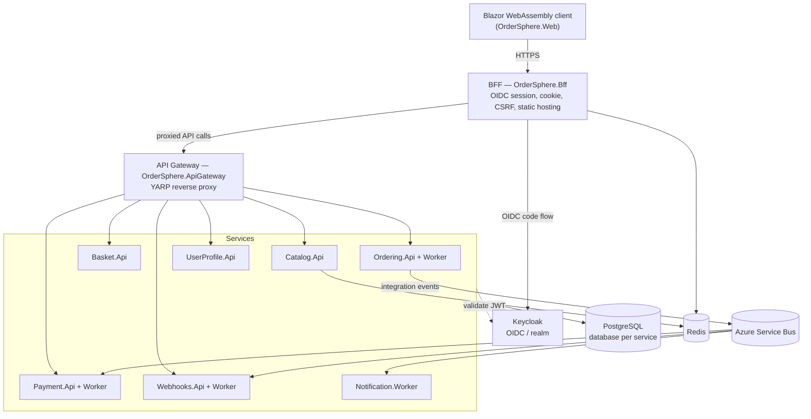

# OrderSphere

[](https://github.com/MoritzWaldau/OrderSphere/actions/workflows/ci.yml)
[](https://github.com/MoritzWaldau/OrderSphere/actions/workflows/codeql.yml)
[](global.json)
[](LICENSE)

OrderSphere is a .NET 10 e-commerce platform built as independently deployable microservices over
Clean Architecture with CQRS (MediatR), Domain-Driven Design, and an event-driven backbone
(Outbox/Inbox over Azure Service Bus). Each service owns its domain, persistence, and
infrastructure. Errors flow through `Result<T>` rather than exceptions; entities carry audit
fields and soft-delete via `AuditableEntity`.

The full system map — per-service project tables, feature inventory, EF migration matrix, and
external-service wiring — is in [docs/architecture.md](docs/architecture.md). Behavioral rules and
conventions are in [CLAUDE.md](CLAUDE.md). This README is the entry point; those documents are the
detail.

## Architecture

Layer dependencies point inward toward the domain
(`Api → Infrastructure → Application → Domain → BuildingBlocks.Domain`, and `Api → Application`).
No service references another service's projects; cross-service communication is HTTP (typed
clients) or Service Bus integration events. The browser never talks to services directly: the
Blazor WebAssembly client is hosted by a BFF that owns the OIDC session, and all API traffic is
proxied through a YARP gateway.



### Services

| Service | Responsibility |
|---|---|
| Catalog | Product and category CRUD; Redis hybrid caching on reads |
| Basket | Customer cart; validates stock via `ICatalogClient` on add |
| Ordering | Order lifecycle; checkout decrements stock and publishes to Service Bus; Worker creates orders and triggers payment |
| Payment | Payment records; Worker consumes the `payment-requests` queue |
| UserProfile | Customer profile data |
| Webhooks | Outbound webhook dispatch driven by integration events |
| Notification | Order-confirmation email on `OrderPlacedIntegrationEvent` |

See [docs/architecture.md](docs/architecture.md) for the per-project breakdown.

## Technology

| Concern | Technology |
|---|---|
| Language / framework | .NET 10, C# |
| Frontend | Blazor WebAssembly (BFF-hosted), MudBlazor |
| API edge | YARP gateway + BFF |
| Persistence | PostgreSQL via EF Core 10 (database per service) |
| Messaging | Azure Service Bus (Outbox/Inbox) |
| Cache | Redis (.NET Hybrid Cache / distributed cache) |
| Email | Azure Communication Services |
| AuthN / AuthZ | Keycloak (OIDC) via BFF + gateway, RBAC |
| Orchestration | .NET Aspire |
| Observability | OpenTelemetry, health checks, service discovery |
| Secrets | Azure Key Vault (non-dev); user-secrets (dev) |

## Enterprise capabilities

Capabilities implemented in the codebase, with the primary location of each:

| Capability | Implementation |
|---|---|
| Reliable messaging (Outbox/Inbox) | Transactional outbox and idempotent inbox over Azure Service Bus — `src/BuildingBlocks/OrderSphere.BuildingBlocks.EventBus*` |
| BFF + gateway edge | Browser never reaches services directly; OIDC session in the BFF, YARP reverse proxy — `src/Gateways/OrderSphere.Bff`, `src/Gateways/OrderSphere.ApiGateway` |
| AuthN / AuthZ | Keycloak OIDC, RBAC, CSRF protection, OIDC backchannel logout, client-credentials service auth — `src/Hosting/OrderSphere.ServiceDefaults`, `Bff/Auth` |
| API versioning & rate limiting | Per-service versioned endpoints with rate-limit policies — `src/Services/Basket/OrderSphere.Basket.Api/Configuration` |
| Resilience & observability | OpenTelemetry traces/metrics, health checks, service discovery — `OrderSphere.ServiceDefaults` |
| Caching | Redis-backed .NET HybridCache on catalog reads — Catalog service |
| Outbound webhooks | Subscription management and event-driven delivery with retry — Webhooks service |
| Real-time notifications | SignalR hub fed by integration events — `Bff/Hubs/NotificationHub.cs` |
| Domain robustness | `Result<T>` error flow, strongly-typed IDs, value objects, soft-delete + audit fields, domain events — `BuildingBlocks.Domain` |
| Security audit logging | Structured security-event logging — `ServiceDefaults/Security/SecurityAuditLogger.cs` |
| Quality & security gates | 70% branch-coverage gate, CodeQL SAST, Dependabot, vulnerable-package scan, dependency review — `.github/workflows` |

## Getting started

### Prerequisites

- **.NET 10 SDK** — the exact version is pinned in [global.json](global.json); the SDK installer
  resolves it automatically.
- **A container runtime** (Docker Desktop or Podman) — Aspire uses it to run PostgreSQL, Redis,
  the Azure Service Bus emulator, and Keycloak.

### Quickstart

```bash
# 1. Clone
git clone https://github.com/MoritzWaldau/OrderSphere.git
cd OrderSphere

# 2. Set the local Keycloak admin password (used only by the dev container)
dotnet user-secrets set "Parameters:keycloak-admin-password" "admin" \
  --project src/Hosting/OrderSphere.AppHost

# 3. Run everything
dotnet run --project src/Hosting/OrderSphere.AppHost
```

Aspire provisions PostgreSQL, Redis, the Azure Service Bus emulator, and Keycloak, then starts all
services, the gateway, and the BFF. The **Aspire dashboard** (URL printed in the console on start)
lists every resolved endpoint, logs, and traces — no manual infrastructure setup is required.

### First-run sign-in

On first start the Keycloak realm `ordersphere` is imported with a set of demo users, but their
passwords are intentionally empty. Seed development passwords once the stack is up:

```powershell
contracts/keycloak/seed-dev-passwords.ps1 -AdminPassword admin
```

This sets the password `Password123!` for all demo users (e.g. `test.admin@ordersphere.dev` for an
admin, `max.mustermann@ordersphere.dev` for a customer). Pass `-Password` to override.

### Run the frontend alone (BFF + WASM)

```bash
dotnet run --project src/Gateways/OrderSphere.Bff
```

## Common commands

Run from the repository root.

| Task | Command |
|---|---|
| Build | `dotnet build OrderSphere.slnx` |
| Run via Aspire | `dotnet run --project src/Hosting/OrderSphere.AppHost` |
| Run BFF (with WASM) | `dotnet run --project src/Gateways/OrderSphere.Bff` |
| All tests | `dotnet test` |
| One test project | `dotnet test tests/OrderSphere.Domain.Tests` |
| Single test by name | `dotnet test --filter "FullyQualifiedName~CheckoutCart"` |

The full EF Core migration matrix (per service) is in
[docs/architecture.md](docs/architecture.md#ef-migrations).

## Conventions

Repository conventions — layer rules, the `Result<T>` contract, feature layout, integration-event
patterns, and commit format — are documented in [CLAUDE.md](CLAUDE.md). UI, theming, and CSS rules
are in [docs/ui-conventions.md](docs/ui-conventions.md).

## License

MIT License — see [LICENSE](LICENSE).
