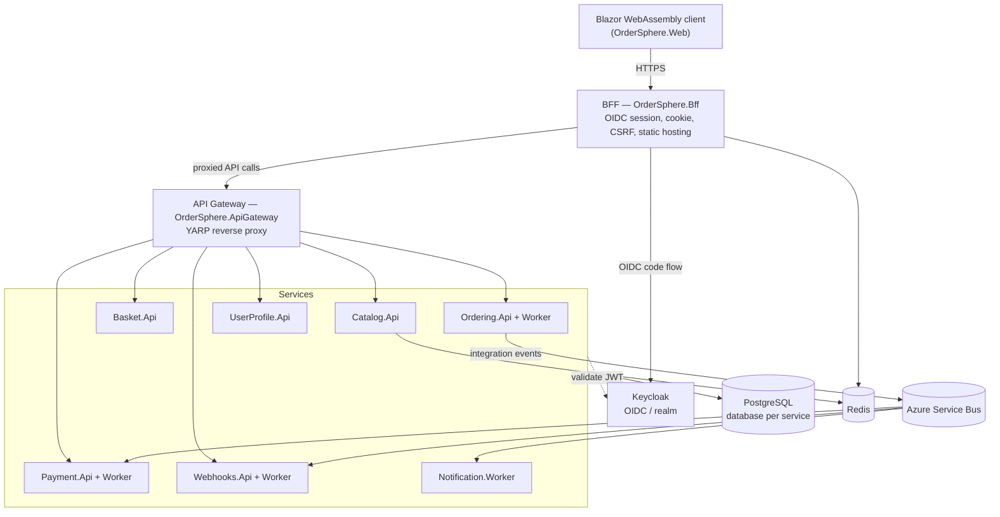

# OrderSphere

[](https://github.com/MoritzWaldau/OrderSphere/actions/workflows/ci.yml)
[](https://github.com/MoritzWaldau/OrderSphere/actions/workflows/codeql.yml)
[](https://securityscorecards.dev/viewer/?uri=github.com/MoritzWaldau/OrderSphere)
[](https://sonarcloud.io/summary/new_code?id=MoritzWaldau_OrderSphere)
[](https://dotnet.microsoft.com/)
[](LICENSE)

> **Status:** Technical reference / portfolio implementation demonstrating microservices and
> Clean Architecture patterns on .NET 10. Not intended for production operation.

OrderSphere is a .NET 10 e-commerce platform built as independently deployable microservices over
Clean Architecture with CQRS (MediatR), Domain-Driven Design, and an event-driven backbone
(Outbox/Inbox over Azure Service Bus). Each service owns its domain, persistence, and
infrastructure. Errors flow through `Result<T>` rather than exceptions; entities carry audit
fields and soft-delete via `AuditableEntity`.

The full system map — per-service project tables, feature inventory, EF migration matrix, and
external-service wiring — is in [docs/architecture.md](docs/architecture.md). Behavioral rules and
conventions are in [CLAUDE.md](CLAUDE.md). This README is the entry point; those documents are the
detail.

## Contents

- [Architecture](#architecture)
- [Technology](#technology)
- [Getting started](#getting-started)
- [Common commands](#common-commands)
- [Deployment](#deployment)
- [Conventions](#conventions)
- [Security](#security)
- [Contributing](#contributing)
- [License](#license)

## Architecture

Layer dependencies point inward toward the domain
(`Api → Infrastructure → Application → Domain → BuildingBlocks.Domain`, and `Api → Application`).
No service references another service's projects; cross-service communication is HTTP (typed
clients) or Service Bus integration events. The browser never talks to services directly: the
Blazor WebAssembly client is hosted by a BFF that owns the OIDC session, and all API traffic is
proxied through a YARP gateway.



### Services

| Service | Responsibility |
|---|---|
| Catalog | Product and category CRUD; Redis hybrid caching on reads |
| Basket | Customer cart; validates stock via `ICatalogClient` on add |
| Ordering | Order lifecycle; checkout decrements stock and publishes to Service Bus; Worker creates orders and triggers payment |
| Payment | Payment records; Worker consumes the `payment-requests` queue |
| UserProfile | Customer profile data |
| Webhooks | Outbound webhook dispatch driven by integration events |
| Notification | Order-confirmation email on `OrderPlacedIntegrationEvent` |

See [docs/architecture.md](docs/architecture.md) for the per-project breakdown.

## Technology

| Concern | Technology |
|---|---|
| Language / framework | .NET 10, C# |
| Frontend | Blazor WebAssembly (BFF-hosted), MudBlazor |
| API edge | YARP gateway + BFF |
| Persistence | PostgreSQL via EF Core 10 (database per service) |
| Messaging | Azure Service Bus (Outbox/Inbox) |
| Cache | Redis (.NET Hybrid Cache / distributed cache) |
| Email | Azure Communication Services |
| AuthN / AuthZ | Keycloak (OIDC) via BFF + gateway, RBAC |
| Orchestration | .NET Aspire |
| Observability | OpenTelemetry, health checks, service discovery |
| Secrets | Azure Key Vault (non-dev); user-secrets (dev) |

## Getting started

### Prerequisites

- .NET 10 SDK
- A container runtime (Docker or Podman) for PostgreSQL, Redis, the Service Bus emulator, and
  Keycloak

### Run the full system (Aspire)

```bash
dotnet run --project src/OrderSphere.AppHost
```

Aspire provisions PostgreSQL, Redis, the Azure Service Bus emulator, and Keycloak, then starts all
services, the gateway, and the BFF. The Aspire dashboard lists the resolved endpoints. On first
start the Keycloak realm is imported; seed development passwords with
`contracts/keycloak/seed-dev-passwords.ps1`.

### Run the frontend alone (BFF + WASM)

```bash
dotnet run --project src/Gateways/OrderSphere.Bff
```

## Common commands

Run from the repository root.

| Task | Command |
|---|---|
| Build | `dotnet build OrderSphere.slnx` |
| Run via Aspire | `dotnet run --project src/OrderSphere.AppHost` |
| Run BFF (with WASM) | `dotnet run --project src/Gateways/OrderSphere.Bff` |
| All tests | `dotnet test` |
| One test project | `dotnet test tests/OrderSphere.Domain.Tests` |
| Single test by name | `dotnet test --filter "FullyQualifiedName~CheckoutCart"` |

The full EF Core migration matrix (per service) is in
[docs/architecture.md](docs/architecture.md#ef-migrations).

## Deployment

OrderSphere is a .NET Aspire application: the AppHost manifest (`src/OrderSphere.AppHost`) is the
single source of truth for the resource topology. The Azure Developer CLI (`azd`, configured via
[azure.yaml](azure.yaml)) reads that manifest and generates the Bicep for Container Apps,
PostgreSQL Flexible Server, Service Bus, Azure Managed Redis, and Key Vault — there is no
hand-written `infra/` folder. Keycloak is deployed independently as the central SSO provider
(see [deploy/sso/](deploy/sso/README.md)).

The full deployment procedure is in
[docs/deploy-ordersphere.md](docs/deploy-ordersphere.md). Deployment pipelines live in
[.github/workflows/](.github/workflows/) (`deploy-staging.yml`, `deploy-prod.yml`, `deploy-sso.yml`).

## Conventions

Repository conventions — layer rules, the `Result<T>` contract, feature layout, integration-event
patterns, and commit format — are documented in [CLAUDE.md](CLAUDE.md). UI, theming, and CSS rules
are in [docs/ui-conventions.md](docs/ui-conventions.md).

## Security

Supply-chain and code security are enforced in CI: CodeQL static analysis, OpenSSF Scorecard,
GitHub dependency review, Dependabot updates, and a vulnerable-package scan (`dotnet list package
--vulnerable`). Non-development secrets are held in Azure Key Vault; development uses .NET
user-secrets. Authentication is delegated to Keycloak (OIDC) via the BFF and gateway, with RBAC
enforced per service.

To report a vulnerability, follow the disclosure process in [SECURITY.md](SECURITY.md).

## Contributing

Contributions follow the workflow in [CONTRIBUTING.md](CONTRIBUTING.md): branch from `master`,
keep changes within one layer where possible, and use Conventional Commit messages (enforced on PR
titles). Released changes are tracked in [CHANGELOG.md](CHANGELOG.md).

## License

MIT License — see [LICENSE](LICENSE).
