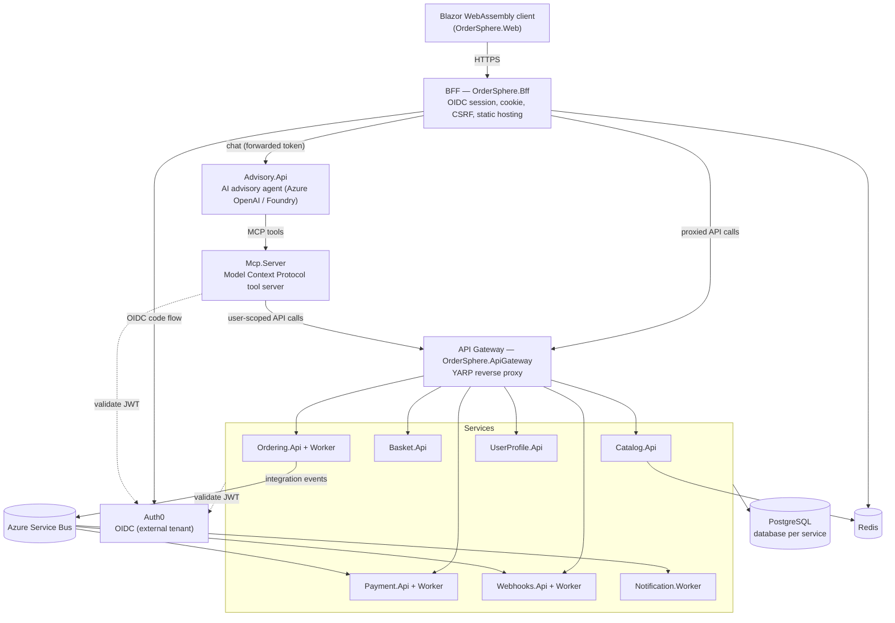

# OrderSphere

[](https://github.com/MoritzWaldau/OrderSphere/actions/workflows/ci.yml)
[](https://github.com/MoritzWaldau/OrderSphere/actions/workflows/codeql.yml)
[](https://sonarcloud.io/summary/new_code?id=MoritzWaldau_OrderSphere)
[](https://dotnet.microsoft.com/)
[](LICENSE)

> **Status:** Technical reference / portfolio implementation demonstrating microservices and
> Clean Architecture patterns on .NET 10. Not intended for production operation.

OrderSphere is a .NET 10 e-commerce platform built as independently deployable microservices over
Clean Architecture with CQRS (MediatR), Domain-Driven Design, and an event-driven backbone
(Outbox/Inbox over Azure Service Bus). Each service owns its domain, persistence, and
infrastructure. Errors flow through `Result<T>` rather than exceptions; entities carry audit
fields and soft-delete via `AuditableEntity`.

The full system map — per-service project tables, feature inventory, EF migration matrix, and
external-service wiring — is in [docs/architecture.md](docs/architecture.md). Behavioral rules and
conventions are in [CLAUDE.md](CLAUDE.md). This README is the entry point; those documents are the
detail.

## Contents

- [Architecture](#architecture)
- [Repository layout](#repository-layout)
- [Screenshots](#screenshots)
- [Technology](#technology)
- [Getting started](#getting-started)
- [Configuration](#configuration)
- [Common commands](#common-commands)
- [Testing and quality](#testing-and-quality)
- [Deployment](#deployment)
- [Conventions](#conventions)
- [Security](#security)
- [Roadmap and status](#roadmap-and-status)
- [Contributing](#contributing)
- [License](#license)

## Architecture

Layer dependencies point inward toward the domain
(`Api → Infrastructure → Application → Domain → BuildingBlocks.Domain`, and `Api → Application`).
No service references another service's projects; cross-service communication is HTTP (typed
clients) or Service Bus integration events. The browser never talks to services directly: the
Blazor WebAssembly client is hosted by a BFF that owns the OIDC session, and all API traffic is
proxied through a YARP gateway.



### Services

| Service | Responsibility |
|---|---|
| Catalog | Product and category CRUD; Redis hybrid caching on reads |
| Basket | Customer cart; validates stock via `ICatalogClient` on add |
| Ordering | Order lifecycle; checkout decrements stock and publishes to Service Bus; Worker creates orders and triggers payment |
| Payment | Payment records; Worker consumes the `payment-requests` queue |
| UserProfile | Customer profile data |
| Webhooks | Outbound webhook dispatch driven by integration events |
| Notification | Order-confirmation email on `OrderPlacedIntegrationEvent` |
| Advisory | Customer-advisory AI agent (`Advisory.Api`) over Azure OpenAI / Foundry; owns no tools of its own and is inert without the MCP server |
| Mcp.Server | Model Context Protocol tool server (Streamable HTTP) exposing the `/api/v1` Gateway surface as user-scoped tools to the agent and external MCP clients |

See [docs/architecture.md](docs/architecture.md) for the per-project breakdown, and
[docs/architecture.md#ai-advisory-agent--mcp-server](docs/architecture.md#ai-advisory-agent--mcp-server)
for the agent/MCP design.

## Repository layout

Top-level orientation only; the per-project breakdown is in
[docs/architecture.md](docs/architecture.md).

```text
src/
  Hosting/        .NET Aspire AppHost (resource topology) + ServiceDefaults
  Gateways/       OrderSphere.Bff (BFF, WASM host) and OrderSphere.ApiGateway (YARP)
  Frontend/       OrderSphere.Web — Blazor WebAssembly client
  Services/       One folder per service (Catalog, Basket, Ordering, Payment,
                  UserProfile, Webhooks, Notification, Advisory) — each with its
                  own Domain / Application / Infrastructure / Api (+ Worker) projects
  BuildingBlocks/ Shared primitives: Domain, Contracts, EventBus, EventBus.AzureServiceBus
tests/            Per-layer and per-service test projects
docs/             Architecture, deployment, auth, UI conventions, assessments
```

## Screenshots

> The image files below are not yet committed. Generate them by running the system
> ([Getting started](#getting-started)), opening the BFF endpoint, and capturing the
> home, catalog, and checkout pages into `docs/assets/`.

| View | Image |
|---|---|
| Home | `docs/assets/home.png` _(to be added)_ |
| Catalog | `docs/assets/catalog.png` _(to be added)_ |
| Checkout | `docs/assets/checkout.png` _(to be added)_ |

## Technology

| Concern | Technology |
|---|---|
| Language / framework | .NET 10, C# |
| Frontend | Blazor WebAssembly (BFF-hosted), MudBlazor |
| API edge | YARP gateway + BFF |
| Persistence | PostgreSQL via EF Core 10 (database per service) |
| Messaging | Azure Service Bus (Outbox/Inbox) |
| Cache | Redis (.NET Hybrid Cache / distributed cache) |
| Email | Azure Communication Services |
| AuthN / AuthZ | Auth0 (OIDC) via BFF + gateway, RBAC |
| Orchestration | .NET Aspire |
| Observability | OpenTelemetry, health checks, service discovery |
| Secrets | Azure Key Vault (non-dev); user-secrets (dev) |

## Getting started

### Prerequisites

- .NET 10 SDK (pinned in [global.json](global.json))
- A container runtime (Docker or Podman) for PostgreSQL, Redis, and the Service Bus emulator

### Configure local secrets

Authentication is delegated to an external Auth0 tenant. The AppHost declares four confidential
client secrets as parameters; without them the BFF login and the worker `client_credentials` flows
fail locally. Set them once as user-secrets on the AppHost project (values come from the Auth0
dashboard — see [docs/deploy-ordersphere.md](docs/deploy-ordersphere.md) step 2 and
[docs/auth/role-model.md](docs/auth/role-model.md)):

```powershell
dotnet user-secrets set "Parameters:bff-client-secret" "<value>"          --project src/Hosting/OrderSphere.AppHost
dotnet user-secrets set "Parameters:ordering-worker-secret" "<value>"     --project src/Hosting/OrderSphere.AppHost
dotnet user-secrets set "Parameters:notification-worker-secret" "<value>" --project src/Hosting/OrderSphere.AppHost
dotnet user-secrets set "Parameters:payment-worker-secret" "<value>"      --project src/Hosting/OrderSphere.AppHost
```

The non-secret parameters `oidc-authority` and `payment-bypass-providers` have local defaults in
`src/Hosting/OrderSphere.AppHost/appsettings.Development.json` and need no setup. The AI advisory
agent is optional: leave `Foundry:Endpoint` unset and the agent degrades gracefully (reports
unavailable) — the rest of the system runs without Azure OpenAI. See [Configuration](#configuration)
for the full key reference.

### Run the full system (Aspire)

```bash
dotnet run --project src/Hosting/OrderSphere.AppHost
```

Aspire provisions PostgreSQL, Redis, and the Azure Service Bus emulator, then starts all
services, the gateway, and the BFF. Authentication is delegated to the external Auth0 tenant; the
local `oidc-authority` defaults to `https://ordersphere-dev.eu.auth0.com/`
(`src/Hosting/OrderSphere.AppHost/appsettings.Development.json`), so no identity provider runs as a
local container.

### After startup

The Aspire dashboard (its URL is printed on startup) is the entry point: it lists every resource,
its health, logs, and resolved endpoints. The application itself is reached through the BFF
resource (`ordersphere-bff`), which is the only public ingress besides the MCP server
(`WithExternalHttpEndpoints()` in the AppHost). Open the BFF endpoint from the dashboard; an
unauthenticated request redirects to the Auth0 login.

### Run the frontend alone (BFF + WASM)

```bash
dotnet run --project src/Gateways/OrderSphere.Bff
```

## Configuration

Central configuration keys and where each value comes from. Locally, secrets are user-secrets on the
AppHost; in Azure they are Key Vault secrets resolved by `azd` / Aspire provisioning.

| Key | Purpose | Source |
|---|---|---|
| `Oidc:Authority` | Auth0 issuer URL | Dev default in `appsettings.Development.json` (`oidc-authority`); Key Vault / azd parameter in Azure |
| `Oidc:Audience` | API audience (`https://api.ordersphere.dev`) | Constant in the AppHost |
| `Oidc:ClientId` / `Oidc:ClientSecret` | BFF and worker client credentials | Client IDs in the AppHost; secrets via user-secrets (dev) / Key Vault (Azure) |
| `Parameters:bff-client-secret` | BFF interactive login client secret | user-secrets (dev) / Key Vault (Azure) |
| `Parameters:ordering-worker-secret` | Ordering M2M worker secret | user-secrets (dev) / Key Vault (Azure) |
| `Parameters:notification-worker-secret` | Notification M2M worker secret | user-secrets (dev) / Key Vault (Azure) |
| `Parameters:payment-worker-secret` | Payment M2M worker secret | user-secrets (dev) / Key Vault (Azure) |
| `payment-bypass-providers` | Skip the external payment provider call | Dev default `true` in `appsettings.Development.json`; azd parameter in Azure |
| `Foundry:Endpoint` / `Foundry:Deployment` | Azure OpenAI / Foundry for the advisory agent (optional) | user-secrets (dev) / managed identity in Azure; unset → agent degrades gracefully |

## Common commands

Run from the repository root.

| Task | Command |
|---|---|
| Build | `dotnet build OrderSphere.slnx` |
| Run via Aspire | `dotnet run --project src/Hosting/OrderSphere.AppHost` |
| Run BFF (with WASM) | `dotnet run --project src/Gateways/OrderSphere.Bff` |
| All tests | `dotnet test` |
| One test project | `dotnet test tests/OrderSphere.Domain.Tests` |
| Single test by name | `dotnet test --filter "FullyQualifiedName~CheckoutCart"` |

The full EF Core migration matrix (per service) is in
[docs/architecture.md](docs/architecture.md#ef-migrations).

## Testing and quality

Tests are organised per layer and per service under `tests/` (domain, application, and
service-specific projects including `OrderSphere.Mcp.Tests` and `OrderSphere.Advisory.Tests`). CI
enforces a 70% branch-coverage gate, formatting (`dotnet format --verify-no-changes`), CodeQL static
analysis, dependency review, and a vulnerable-package scan; a pull request must pass these before
merge. The per-project test inventory is in [docs/architecture.md](docs/architecture.md). Local
checks are listed in [CONTRIBUTING.md](CONTRIBUTING.md#local-checks).

## Deployment

OrderSphere is a .NET Aspire application: the AppHost manifest (`src/Hosting/OrderSphere.AppHost`) is
the single source of truth for the resource topology. The Azure Developer CLI (`azd`, configured via
[azure.yaml](azure.yaml)) reads that manifest and generates the Bicep for Container Apps,
PostgreSQL Flexible Server, Service Bus, Azure Managed Redis, and Key Vault — there is no
hand-written `infra/` folder. Authentication is delegated to an external Auth0 tenant, supplied to
the deployment through the `oidc-authority` parameter and four confidential client secrets.

The full deployment procedure is in
[docs/deploy-ordersphere.md](docs/deploy-ordersphere.md). Application deploy pipelines are not yet
implemented (generated by `azd pipeline config` after the first manual deploy).

## Conventions

Repository conventions — layer rules, the `Result<T>` contract, feature layout, integration-event
patterns, and commit format — are documented in [CLAUDE.md](CLAUDE.md). UI, theming, and CSS rules
are in [docs/ui-conventions.md](docs/ui-conventions.md); service contract conventions (HTTP clients
and integration events) are in [contracts/CONVENTIONS.md](contracts/CONVENTIONS.md). The full
documentation set is indexed in [docs/README.md](docs/README.md), including architecture decision
records ([docs/adr/](docs/adr/README.md)), the domain [glossary](docs/glossary.md), and the
[operations runbook](docs/operations.md).

## Security

Supply-chain and code security are enforced in CI: CodeQL static analysis, GitHub dependency
review, Dependabot updates, a vulnerable-package scan (`dotnet list package --vulnerable`), secret
scanning (Gitleaks), and filesystem/misconfiguration scanning (Trivy). Non-development secrets are
held in Azure Key Vault; development uses .NET user-secrets. Authentication is delegated to
Auth0 (OIDC) via the BFF and gateway, with RBAC enforced per service.

To report a vulnerability, follow the disclosure process in [SECURITY.md](SECURITY.md).

## Roadmap and status

OrderSphere is a technical reference / portfolio implementation, not a production system (see the
status note at the top). Known open items already reflected in the docs:

- **Application deploy pipelines are not yet implemented.** Infrastructure provisioning via `azd` is
  in place; the per-application CI/CD workflow is generated by `azd pipeline config` after the first
  manual deploy (see [docs/deploy-ordersphere.md](docs/deploy-ordersphere.md#cicd--azd-pipeline-config)).
- **Screenshots are not yet committed** (see [Screenshots](#screenshots)).

## Contributing

Contributions follow the workflow in [CONTRIBUTING.md](CONTRIBUTING.md): branch from `master`,
keep changes within one layer where possible, and use Conventional Commit messages. Released
changes are tracked in [CHANGELOG.md](CHANGELOG.md).

## License

MIT License — see [LICENSE](LICENSE).
