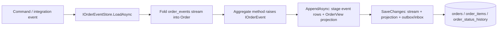
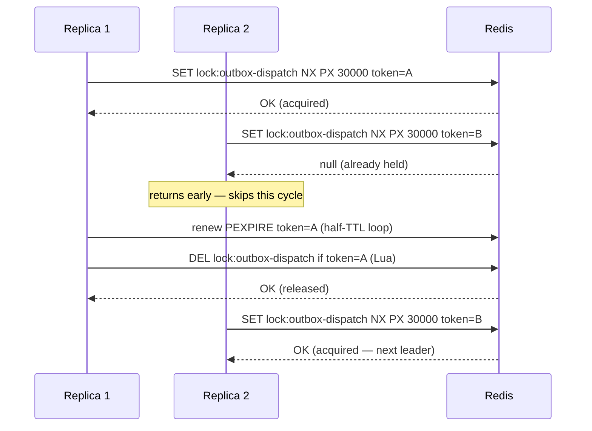

# OrderSphere — Architecture Reference

Detailed system map for OrderSphere. Behavioral rules and conventions live in the
repository-root [CLAUDE.md](../CLAUDE.md); this file is the lookup reference it points to.

## System diagram

A rendered request-flow diagram is in the repository-root [README.md](../README.md#architecture)
(Mermaid). Editable source diagrams are kept in this folder:

- `architecture.excalidraw` — service/component topology.
- `enterprise-architecture.excalidraw` — enterprise context view (external systems, boundaries).

> **TODO (manual export):** export both `.excalidraw` files to `docs/assets/architecture.svg` and
> `docs/assets/enterprise-architecture.svg` (Excalidraw → Export image → SVG) and embed them here:
> ``. The export step requires the Excalidraw app and is
> not committed yet.

## Shared primitives (BuildingBlocks)

- `BuildingBlocks.Domain` — `ICommand`, `IQuery`, `Result<T>`, `AuditableEntity`, `Error`, `IBlobStorageService` (`/Blob`), MediatR pipeline behaviors
- `BuildingBlocks.Contracts` — Integration event DTOs shared across service boundaries (naming and versioning rules: [../contracts/CONVENTIONS.md](../contracts/CONVENTIONS.md))
- `BuildingBlocks.EventBus` — `IEventBus` abstraction
- `BuildingBlocks.EventBus.AzureServiceBus` — Azure Service Bus implementation
- `BuildingBlocks.Infrastructure` — shared infrastructure implementations (Azure Blob storage: `BlobStorageClients`, `AzureBlobStorageService`, `DisabledBlobStorageService` no-op fallback)

## Project layout

### BuildingBlocks
| Project | Responsibility |
|---|---|
| `src/BuildingBlocks/OrderSphere.BuildingBlocks.Domain` | `ICommand`, `IQuery`, `Result<T>`, `AuditableEntity`, `Error`, MediatR behaviors |
| `src/BuildingBlocks/OrderSphere.BuildingBlocks.Contracts` | Integration event DTOs (`CheckoutCartIntegrationEvent`, `OrderPlacedIntegrationEvent`, etc.) |
| `src/BuildingBlocks/OrderSphere.BuildingBlocks.EventBus` | `IEventBus` abstraction |
| `src/BuildingBlocks/OrderSphere.BuildingBlocks.EventBus.AzureServiceBus` | Azure Service Bus implementation |
| `src/BuildingBlocks/OrderSphere.BuildingBlocks.Infrastructure` | Shared infrastructure implementations — Azure Blob storage (`BlobStorageClients`, `AzureBlobStorageService`, `DisabledBlobStorageService`) behind `IBlobStorageService`. Consumed by Catalog (product images) and Invoicing (invoice PDFs). |

### Services
| Service | Projects | Notes |
|---|---|---|
| Catalog | `Catalog.Domain`, `Catalog.Application`, `Catalog.Infrastructure`, `Catalog.Api` | Product + Category CRUD; Redis hybrid caching |
| Ordering | `Ordering.Domain`, `Ordering.Application`, `Ordering.Infrastructure`, `Ordering.Api`, `Ordering.Worker` | Order lifecycle; checkout publishes to Service Bus; Worker creates orders and triggers payment |
| Basket | `Basket.Domain`, `Basket.Application`, `Basket.Infrastructure`, `Basket.Api` | Customer cart; validates stock via `ICatalogClient` on add |
| Payment | `Payment.Domain`, `Payment.Application`, `Payment.Infrastructure`, `Payment.Api`, `Payment.Worker` | Payment records; Worker consumes `payment-requests` queue |
| Webhooks | `Webhooks.Domain`, `Webhooks.Application`, `Webhooks.Infrastructure`, `Webhooks.Api`, `Webhooks.Worker` | Subscription CRUD + outbound webhook dispatch; Worker consumes integration events |
| Notification | `Notification.Worker` | Sends order confirmation emails via Azure Communication Services. Deliberate exception to the per-service layering: a worker-only service with no Domain/Application/Infrastructure split — its `DbContext` lives in the Worker (inbox idempotency only). |
| UserProfile | `UserProfile.Domain`, `UserProfile.Application`, `UserProfile.Infrastructure`, `UserProfile.Api` | Customer profile data |
| Invoicing | `Invoicing.Domain`, `Invoicing.Application`, `Invoicing.Infrastructure`, `Invoicing.Api` | Generates invoice PDFs (QuestPDF) on `OrderPlacedIntegrationEvent`, stores them in Blob storage, publishes `invoice-ready`. The Service Bus consumer (`InvoiceProcessor`) runs inside the Api as a `BackgroundService` — no separate Worker project. JWT-protected download endpoints. See [src/Services/Invoicing/CLAUDE.md](../src/Services/Invoicing/CLAUDE.md). |
| Advisory | `Advisory.Api`, `Mcp.Server` (both under `src/Services/Advisory/`) | Customer-advisory AI agent + MCP tool server. See [AI advisory](#ai-advisory-agent--mcp-server). |

### Infrastructure & Frontend
| Project | Responsibility |
|---|---|
| `src/Hosting/OrderSphere.ServiceDefaults` | Shared startup: OpenTelemetry, health checks, service discovery, resilience |
| `src/Hosting/OrderSphere.AppHost` | .NET Aspire orchestration (Postgres, Redis, Service Bus, all services) |
| `src/Gateways/OrderSphere.ApiGateway` | YARP reverse proxy — routes external traffic to services |
| `src/Gateways/OrderSphere.Bff` | BFF — hosts Blazor WASM, handles OIDC session |
| `src/Frontend/OrderSphere.Web` | Blazor WASM client — pages, components, typed API clients |

### Tests
xUnit + FluentAssertions (NSubstitute for mocking; EF Core in-memory, or SQLite in-memory where a real `DbContext` must exercise global query filters — required for entities with complex properties such as `Product.Price`).

| Project | Covers |
|---|---|
| `tests/OrderSphere.Domain.Tests` | Domain entity/value-object unit tests across Ordering, Basket, Catalog, Payment |
| `tests/OrderSphere.Ordering.Checkout.Tests` | Ordering checkout flow |
| `tests/OrderSphere.Ordering.Authorization.Tests` | Ordering authorization policy tests |
| `tests/OrderSphere.UserProfile.Tests` | UserProfile service |
| `tests/OrderSphere.Bff.Tests` | BFF integration tests |
| `tests/OrderSphere.Mcp.Tests` | MCP tool methods against a mocked gateway (NSubstitute); gateway request-path pinning; in-process MCP server integration tests (transport, tool discovery, annotations) |
| `tests/OrderSphere.Advisory.Tests` | `AdvisorChatService` against a scripted `IChatClient`: persistence, anonymous/ephemeral turns, corrupt-session recovery, mid-stream failure handling, tool-activity events |

## Features

| Aggregate | Service | Notes |
|---|---|---|
| Cart | Basket | Add/remove/decrease items; validates stock via Catalog HTTP client |
| Product | Catalog | CRUD + public slug/id lookups; Redis hybrid caching on reads |
| Category | Catalog | Hierarchy management; products reference categories by ID |
| Order | Ordering | Placement, retrieval, status transitions (Created → Paid → Shipped → Delivered / Cancelled). Event-sourced write model — see [Ordering write model](#ordering-write-model-event-sourced) |
| Checkout | Ordering | Cart-to-order flow: fetches cart + decrements stock synchronously, then publishes `CheckoutCartIntegrationEvent` to Service Bus |
| Coupon | Ordering | `ValidateCoupon` query; hardcoded codes `WELCOME10`, `SUMMER15` |
| Payment | Payment | `PaymentRecord` created by Worker on `payment-requests` queue; status: Pending → Authorized → Captured / Failed |
| Webhooks | Webhooks | Outbound webhook dispatch triggered by integration events |
| Notification | Notification | Order confirmation email on `OrderPlacedIntegrationEvent`; invoice-ready email on `InvoiceGeneratedIntegrationEvent` |
| UserProfile | UserProfile | Customer profile data |
| Invoice | Invoicing | PDF generation on `OrderPlacedIntegrationEvent` with a gap-free sequential invoice number (`INV-{year}-{counter}`, row-locked counter table); metadata + SAS download + inline/attachment PDF endpoints (owner or admin only); admin lookup by invoice number; admin discount/credit-note adjustments with Net/VAT/Gross recalculation and audit trail |

## Ordering write model (event-sourced)

The `Order` aggregate is event-sourced: its state is never persisted directly. Every mutation
raises an `IOrderEvent` (`OrderCreated`, `CouponApplied`, `ShippingCostSet`, `OrderConfirmed`,
`OrderShipped`, `OrderDelivered`, `OrderCancelled`) that is appended to the order's stream in
`order_events`. Loading rebuilds the aggregate by folding the stream in version order. This is a
deliberately scoped island — only the Order aggregate is event-sourced; every other aggregate
remains state-based.

- **Stream & concurrency.** `order_events` has a composite primary key `(StreamId, Version)`,
  where `Version` is a gap-free 1-based sequence per order. The key doubles as the optimistic
  concurrency guard: two writers appending the same next version collide on insert, surfacing as a
  unique-constraint violation the caller treats as a lost race (`OrderProcessor` already handles
  this idempotently).
- **Serialization.** Events are stored as JSON with an explicit type discriminator
  (`OrderEventSerializer`), so the stream is decoupled from CLR namespace/assembly moves. Payloads
  are primitive (`Guid`/`string`/`int`/`decimal`) rather than value objects, keeping the stored
  contract stable across value-object refactors.
- **Read projection.** The read side is unchanged: the same `orders`, `order_items`, and
  `order_status_history` tables, now populated by the `OrderView` projection. `IOrderEventStore`
  stages the new events **and** the projection into the change tracker without saving; the caller's
  single `SaveChanges` commits the stream, the projection, and any outbox/inbox rows in one
  transaction, so reads are synchronously consistent with the write side. All order queries and the
  A3 `order-history` read-model are untouched.
- **Touchpoints.** `OrderProcessor`, `PaymentResultProcessor` (including confirmation-failure
  compensation), `UpdateOrderStatusCommandHandler`, and `CancelOrderCommandHandler` load and append
  through `IOrderEventStore`.

## Distributed locking / leader-election

Background jobs that poll a database table or perform scheduled maintenance (outbox dispatchers,
reservation sweeper, webhook delivery, conversation cleanup) must not double-execute when a
service scales to multiple replicas. A6 introduces a Redis-backed lease mechanism so that among
N running instances exactly one acts as leader for each job at any time.

### Primitive

**Abstraction** — `IDistributedLock` + `IDistributedLockHandle` in
`BuildingBlocks.Domain/Locking/` (`OrderSphere.BuildingBlocks.Locking` namespace). Disposable
handle pattern: acquire returns a handle or `null` (no blocking); disposing the handle releases
the lease.

**Implementation** — `RedisDistributedLock` in `ServiceDefaults/DistributedLockExtensions.cs`.
Registration: `builder.Services.AddOrderSphereDistributedLocking()`, called after
`AddOrderSphereRedisAsync()`.

Protocol:
- **Acquire:** `SET lock:{resource} {token} NX PX {ttlMs}` — atomic, single round-trip.
- **Release:** Lua compare-and-delete ensures only the token holder can delete the key, so a
  slow instance whose lease expired cannot release a lease re-taken by another instance.
- **Auto-renew:** a background loop issues a token-checked `PEXPIRE` at half-TTL to keep the
  lease alive for long-running work cycles.

`NullDistributedLock` (always-acquire no-op) is registered by `AddOutboxProcessing<TContext>`
via `TryAddSingleton` as a fallback for single-instance or test deployments.

### Protected jobs

| Job | Service | Lock key | TTL |
|---|---|---|---|
| `OutboxDispatcher<TContext>` | Ordering (Api + Worker), Payment (Api + Worker) | `outbox-dispatch:{DbContextName}` | 30 s |
| `OutboxCleanupService<TContext>` | Same | `outbox-cleanup:{DbContextName}` | 5 min |
| `ReservationSweeper` | Catalog.Api | `catalog:reservation-sweep` | 1 min (= sweep interval) |
| `WebhookDeliveryProcessor` | Webhooks.Worker | `webhooks:delivery` | 50 s (= 10× poll interval) |
| `ConversationCleanupService` | Advisory.Api | `advisory:conversation-cleanup` | 24 h (= sweep interval) |

**Not locked — by design:** Azure Service Bus queue consumers (`OrderProcessor`,
`PaymentProcessor`, `PaymentResultProcessor`, etc.). These use the competing-consumers pattern
with inbox idempotency; locking would throttle message throughput with no correctness benefit.

### Leader-election sequence

### Observability

- `ordersphere.lock.acquired` (counter, tag: `resource`) — incremented each successful acquire.
- `ordersphere.lock.contended` (counter, tag: `resource`) — incremented when another instance
  holds the lease (visible in the Aspire dashboard via OTLP).

## AI advisory agent + MCP server

A customer-advisory chat agent, deliberately split into two independently deployable
components under `src/Services/Advisory/`:

- **`OrderSphere.Mcp.Server`** — a Model Context Protocol server (Streamable HTTP, `MapMcp("/mcp")`).
  Holds **no** LLM logic, only tools. Each tool wraps the public API Gateway surface through a typed
  `IOrderSphereGateway` (`Gateway/OrderSphereGateway.cs`). Reusable by the internal agent and by
  external MCP clients (Claude Desktop, IDEs).
- **`OrderSphere.Advisory.Api`** — the agent service (layered: `Advisory.Domain`, `Advisory.Application`,
  `Advisory.Infrastructure`, `Advisory.Api`). Connects to Azure OpenAI / Foundry
  (`DefaultAzureCredential`, no API key) via Microsoft Agent Framework and exposes a streaming chat
  endpoint (`POST /chat`, SSE) plus read-only history (`GET /conversations`,
  `GET /conversations/{id}`). It owns **no** tools of its own: it loads the MCP server's tools per
  request (`AdvisorChatService`) and is inert without the MCP connection. `/chat` is rate-limited
  **per user** (partitioned by `sub`, 20/min) because each request drives an LLM completion. The MCP
  endpoint itself is rate-limited per user at 120/min — deliberately well above the chat limit, since
  one chat turn produces several MCP requests (initialize, tools/list, one per tool call) attributed
  to the same end user.

The shared chat-client pipeline (`FoundryChatClientFactory`, singleton) wires, outermost first:
`UseChatReducer(MessageCountingChatReducer)` (bounds history sent to the model; the full transcript
stays in `advisory-db`) → `UseFunctionInvocation` (tool-call loop) → `UseOpenTelemetry` (one GenAI
span per model round-trip, source `OrderSphere.Advisory.Agent`, visible in the Aspire dashboard).
The reducer must sit outside the function-invocation loop because it drops function call/result
messages. During streaming, `AdvisorChatService` emits tool-activity notices (named SSE `event: tool`
frames with a German label) alongside text tokens; the chat drawer shows them as an activity line.

### Conversation persistence

Conversations are durable, owned per customer (Auth0 `sub`), in `advisory-db` (Postgres, EF Core).
After each turn `AdvisorChatService` serializes the agent session (chat history) via
`AIAgent.SerializeSessionAsync` into `Conversation.SerializedSession` and rehydrates it on the next
request with `DeserializeSessionAsync` — so context survives restarts and is shared across instances.
A human-readable transcript is stored in `ConversationMessages` (role + text) for display and audit.
The `(CustomerSub, ConversationKey)` pair is unique. The DbContext is reached through
`IAdvisoryDbContext` (declared in `Advisory.Application/Abstractions`); the chat service is scoped.

The agent is built per request because its tools are bound to the **current user**: the MCP client
carries the caller's bearer token so user-scoped tools resolve the correct customer.

### Identity forwarding

Data stays customer-scoped through a bearer-token chain:
`BFF (cookie → access_token) → Advisory.Api → MCP.Server → API Gateway → services`.
The MCP server attaches the inbound `Authorization` header to downstream calls via
`Gateway/BearerForwardingHandler.cs`; existing JWT validation on each service enforces scoping.
Public catalog tools work anonymously; user-scoped tools return no data without a valid token.

### MCP tools

All read-only, and annotated as such (`ReadOnly`, `Idempotent`, non-`Destructive`, closed-world) so
external MCP clients can treat them as safe. Routes are the public `/api/v1` Gateway surface.

| Tool | Route | Scope |
|---|---|---|
| `search_products` | `GET /products` (server-side `searchTerm`, `categoryName`, `minPrice`, `maxPrice`) | public |
| `get_product` | `GET /products/{slug}` | public |
| `list_categories` | `GET /categories` | public |
| `get_my_orders` | `GET /orders` | user |
| `get_order_status` | `GET /orders/{id}` | user |
| `validate_coupon` | `GET /coupons/validate` | user |
| `get_my_profile` | `GET /profile` | user |
| `list_my_addresses` | `GET /profile/addresses` | user |
| `get_my_cart` | `GET /cart` | user |
| `get_payment_status` | `GET /payments/by-order/{orderId}` | user |

Write actions (add-to-cart, checkout, profile mutations) are intentionally excluded; adding them is a
new auth/workflow path that requires explicit sign-off.

### Configuration

`Foundry:Endpoint` and `Foundry:Deployment` are read by `Advisory.Api`. When the endpoint is unset the
agent degrades gracefully (returns a "not configured" message) so local runs work without Azure. Set
locally via user-secrets on the AppHost; authenticate with `az login`. Auth0 defines a public PKCE
application `advisory-mcp` for external MCP clients.

## Internal service-to-service authentication

Every internal (non-gateway) HTTP and gRPC call between services is authenticated with an OAuth2
`client_credentials` (M2M) token, acquired and cached by `ClientCredentialsTokenHandler`
(`ServiceDefaults/Authentication/ClientCredentialsTokenHandler.cs`) and attached via
`.AddClientCredentialsHandler()` on the calling `IHttpClientBuilder`. Because ASP.NET Core's gRPC
client factory (`AddGrpcClient<T>`) also returns an `IHttpClientBuilder`, the same extension method
secures both HTTP clients and the one gRPC client (Basket → Catalog) without separate gRPC-specific
plumbing.

All services validate against the same Auth0 tenant and the same audience (`OidcAudience` constant
in `AppHost.cs`, `https://api.ordersphere.dev`) — there is no per-service audience segmentation, so
an M2M token acquired by any service passes JWT-bearer validation on any other. M2M tokens carry no
`https://ordersphere.dev/roles` claim, so internal endpoints authorize with a bare
`.RequireAuthorization()` (any authenticated caller), never a role-based policy — a role policy would
always reject an M2M caller.

| Caller → Callee | Protocol | Caller credential |
|---|---|---|
| Ordering.Api/Worker → Catalog | HTTP | Ordering's own M2M app |
| Ordering.Api → Basket | HTTP | Ordering's own M2M app |
| Catalog.Api → Ordering | HTTP | Catalog's own M2M app |
| Basket.Api → Catalog | gRPC | Reuses Ordering's M2M app (no separate Auth0 application provisioned) |
| Notification.Worker → UserProfile | HTTP | Notification's own M2M app |

Secured internal endpoint groups: Catalog `internal/products`, `internal/reservations`, and the
`CatalogGrpcService` gRPC service; Ordering `internal` (purchase verification); Basket
`/internal/cart`; UserProfile `internal/profiles`; Payment `/internal/payments`.

**Secret rotation**: `Oidc:ClientSecret` per service and the Stripe API keys are Aspire parameters
(`builder.AddParameter(..., secret: true)` in `AppHost.cs`) backed by Azure Key Vault
(`ordersphere-kv`) in deployed environments and by `dotnet user-secrets` locally — never committed.
Rotating a secret means: create a new secret version in Key Vault, update the corresponding
parameter value (azd/CI picks it up on next deploy), then revoke the old Auth0 client secret once
the new one is confirmed live. Auth0 M2M client IDs are not secret and are hardcoded directly in
`AppHost.cs`. Redis avoids this class of secret entirely — `RedisExtensions.cs` authenticates via
Managed Identity (`DefaultAzureCredential`), so there is no password to rotate.

## EF Migrations

Each service owns its migrations. Pattern: `-p <Infrastructure project> -s <Api project>`.

| Service | Add migration | Apply |
|---|---|---|
| Catalog | `dotnet ef migrations add <Name> -p src/Services/Catalog/OrderSphere.Catalog.Infrastructure -s src/Services/Catalog/OrderSphere.Catalog.Api` | same with `database update` |
| Ordering | `dotnet ef migrations add <Name> -p src/Services/Ordering/OrderSphere.Ordering.Infrastructure -s src/Services/Ordering/OrderSphere.Ordering.Api` | same with `database update` |
| Basket | `dotnet ef migrations add <Name> -p src/Services/Basket/OrderSphere.Basket.Infrastructure -s src/Services/Basket/OrderSphere.Basket.Api` | same with `database update` |
| Payment | `dotnet ef migrations add <Name> -p src/Services/Payment/OrderSphere.Payment.Infrastructure -s src/Services/Payment/OrderSphere.Payment.Api` | same with `database update` |
| Webhooks | `dotnet ef migrations add <Name> -p src/Services/Webhooks/OrderSphere.Webhooks.Infrastructure -s src/Services/Webhooks/OrderSphere.Webhooks.Api` | same with `database update` |
| UserProfile | `dotnet ef migrations add <Name> -p src/Services/UserProfile/OrderSphere.UserProfile.Infrastructure -s src/Services/UserProfile/OrderSphere.UserProfile.Api` | same with `database update` |
| Advisory | `dotnet ef migrations add <Name> -p src/Services/Advisory/OrderSphere.Advisory.Infrastructure -s src/Services/Advisory/OrderSphere.Advisory.Api` | same with `database update` |
| Invoicing | `dotnet ef migrations add <Name> -p src/Services/Invoicing/OrderSphere.Invoicing.Infrastructure -s src/Services/Invoicing/OrderSphere.Invoicing.Api` | same with `database update` |

## External services

- **Database**: PostgreSQL via EF Core. Each service has its own `DbContext` under `<Service>.Infrastructure/Persistence/`. Configurations applied via `ApplyConfigurationsFromAssembly`. Migrations are per-service (see above).
- **Cache**: Redis via .NET Hybrid Cache. Used by Catalog service for product/category reads.
- **Email**: Azure Communication Services. Implemented in `Notification.Worker/Email/NotificationEmailService.cs`. Triggered by `OrderPlacedIntegrationEvent` (order confirmation) and `InvoiceGeneratedIntegrationEvent` (invoice-ready). Connection string and sender address read from configuration.
- **Blob storage**: Azure Blob Storage via `BuildingBlocks.Infrastructure` (`BlobStorageClients` behind `IBlobStorageService`, `DefaultAzureCredential`). Used by Catalog (product images) and Invoicing (invoice PDFs). Provisioned only in publish mode from the Aspire manifest (`AppHost.cs` — Invoicing gets the `invoice-storage` account / `invoices` container); local runs leave the endpoint empty and `DisabledBlobStorageService` degrades gracefully (no-op upload, external-URL fallback).
- **PDF generation**: QuestPDF, in `Invoicing.Infrastructure/Pdf/QuestPdfInvoiceService.cs`, renders invoice documents server-side.
- **Search**: Azure AI Search, optional read-model for catalog hybrid (BM25 keyword + vector) search. PostgreSQL stays the system of record; the index is a derived, best-effort copy. Implemented in `Catalog.Infrastructure/Search/` behind `IProductSearchIndex`; write handlers sync best-effort, `GetProductsQueryHandler` queries the index when enabled and falls back to the database otherwise. Provisioned only in publish mode from the Aspire manifest (`AppHost.cs`, **Free** tier), with no local emulator — local runs leave `Search:Endpoint` empty and degrade to database `LIKE` search. Access is managed-identity only (`DefaultAzureCredential`); azd generates the `SearchServiceContributor` + `SearchIndexDataContributor` roles. The shared container-app identity additionally needs `Cognitive Services OpenAI User` on the Foundry account for embeddings — Foundry is external to this azd project, so that role is granted by the `postprovision` hook in `azure.yaml`. The hook reads the identity from the generated `MANAGED_IDENTITY_PRINCIPAL_ID` output automatically; only the external Foundry scope must be supplied once via `azd env set AZURE_FOUNDRY_RESOURCE_ID <account-resource-id>`.
- **Service Bus**: Azure Service Bus via `BuildingBlocks.EventBus.AzureServiceBus`. Queues are declared in `src/Hosting/OrderSphere.AppHost/AppHost.cs`; each is published by an Ordering/Payment outbox handler and consumed by exactly one worker:

  | Queue | Published by | Consumed by |
  |---|---|---|
  | `orders` | Ordering checkout (`RealServiceBusPublisher`) | `Ordering.Worker` (`OrderProcessor`) |
  | `notification-orders` | Ordering (`OrderPlacedEventHandler`) | `Notification.Worker` (`NotificationProcessor`) |
  | `invoice-generation` | Ordering (`OrderPlacedEventHandler`) | `Invoicing.Api` (`InvoiceProcessor`) |
  | `invoice-ready` | `Invoicing.Api` (`InvoiceProcessor`) | `Notification.Worker` (`InvoiceGeneratedProcessor`) |
  | `payment-requests` | Ordering (`PaymentRequestedEventHandler`) | `Payment.Worker` (`PaymentProcessor`) |
  | `payment-results` | Payment (`PaymentProcessedEventHandler`) | `Ordering.Worker` (`PaymentResultProcessor`) |
  | `realtime-notifications` | Ordering (`RealtimeNotificationEventHandler`) | `BFF` (`RealtimeNotificationProcessor`, SignalR fan-out) |
  | `webhook-events` | Ordering (`OrderStatusChangedEventHandler`) | `Webhooks.Worker` (`WebhookEventProcessor`) |

  `OrderPlacedEventHandler` fans the same `OrderPlacedIntegrationEvent` out to two queues
  (`notification-orders` and `invoice-generation`) — Service Bus uses point-to-point queues here,
  so each consumer needs its own queue. Both publishes are at-least-once; the consumers' inbox
  dedupe discards duplicates from an outbox retry.

  Each consumer above (except the BFF's `realtime-notifications`) exposes an admin-protected
  dead-letter reader/replay surface for its owned queues, routed through the API Gateway under
  `/api/v1/admin/{slug}/dlq` (`ordering`, `payment`, `notification`, `webhooks`, `invoicing`), plus a
  per-queue `ordersphere.dlq.depth` gauge. Shared implementation:
  `BuildingBlocks.EventBus.AzureServiceBus/Dlq/`, wired via `AddDlqAdmin(...)`. See
  [docs/operations.md](operations.md) for the endpoint reference and replay runbook.

## Payment provider integration

### Architecture

Payment processing is abstracted behind `IPaymentProvider` (in `Payment.Infrastructure/Providers/`).
The interface models a two-phase flow: `AuthorizeAsync → CaptureAsync → RefundAsync`, all returning
`Result<T>`. `PaymentProviderFactory` resolves the correct provider by `MethodName` (case-insensitive).

The current providers (`CreditCardPaymentProvider`, `PayPalPaymentProvider`, `InvoicePaymentProvider`)
are simulated placeholders. `CreditCardPaymentProvider` is the designated slot for a future Stripe
integration.

### Adding a new provider (e.g. Stripe)

1. **Create** `XyzPaymentProvider : IPaymentProvider` in `Payment.Infrastructure/Providers/`.
   - `MethodName` must match the string sent in `PaymentRequestedIntegrationEvent.PaymentMethod`.
   - `AuthorizeAsync` creates the charge intent; `CaptureAsync` finalises it; `RefundAsync` reverses it.
   - Use `IOptions<PaymentOptions>` (or a dedicated sub-options class) for API keys and secrets.
     Never hardcode credentials — inject via User Secrets locally and Key Vault in production.
2. **Register** in `DependencyInjection.AddPaymentInfrastructure`:
   `services.AddSingleton<IPaymentProvider, XyzPaymentProvider>();`
   Remove or retain the placeholder provider as appropriate.
3. **Idempotency**: `PaymentRequest.OrderId` is suitable as an idempotency key for providers that
   support it (e.g. Stripe's `IdempotencyKey` header). Use it to prevent double-charges on retries.
4. **Webhook-based capture** (asynchronous confirmation) is not yet modelled. The current
   `Authorize → Capture` sequence is synchronous and suitable for providers with manual capture.
   Asynchronous capture confirmation requires a separate webhook endpoint and a new domain transition
   on `PaymentRecord` — treat that as a separate feature.

### Development bypass

When `Payment:BypassProviders` is `true` (default in `appsettings.Development.json`), no provider
is contacted. The `PaymentProcessor` marks every payment as `Captured` immediately with a `DEV-*`
transaction ID. Set to `false` locally to exercise the real provider path.
